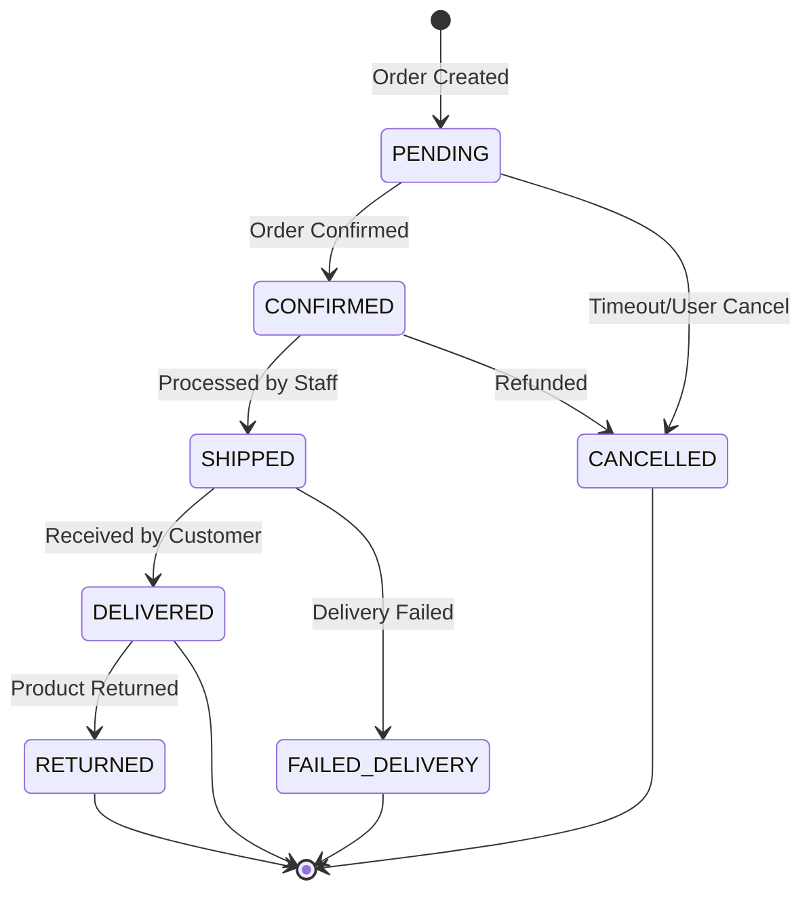

# Order Lifecycle & State Machine

> [!WARNING]
> Legacy reference only. This file contains historical lifecycle extensions.
> Current domain truth is locked in `CONTEXT.md` and `docs/adr/0001-order-inventory-lifecycle.md`.

## State Transitions

## Valid Transitions

- `PENDING` -> `CONFIRMED`: Order commitment is accepted and inventory can be deducted at this transition.
- `PENDING` -> `CANCELLED`: Timeout or user cancel.
- `CONFIRMED` -> `SHIPPED`: Order processed and handed to carrier.
- `CONFIRMED` -> `CANCELLED`: Allowed cancellation path before delivery.
- `SHIPPED` -> `DELIVERED`: Courier confirmation.
- `FAILED_DELIVERY` and `RETURNED` are post-MVP extensions and should not be treated as core MVP states unless re-approved.

## Business Rules

### 1. Stock Locking

- Stock is deducted when status moves to `CONFIRMED`.
- Stock is returned when a `CONFIRMED` order moves to `CANCELLED`.

### 2. Transition Validation

- Status can only move forward in the defined sequence (except `CANCELLED`).
- `DELIVERED` is a terminal state.

### 3. Notification

- Email timing should follow the currently approved checkout flow; for inventory rules, `CONTEXT.md` and the ADR take precedence.
